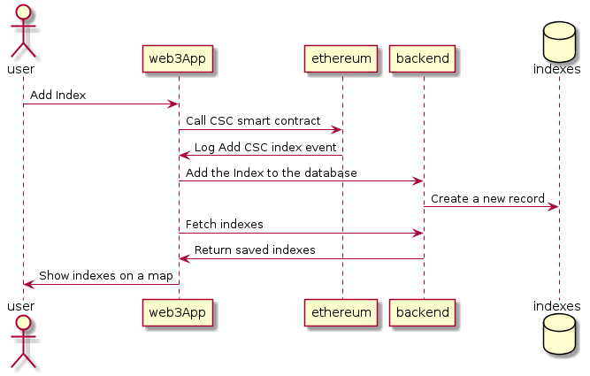

# OnChain Land Administration
The land registry and real estate transactions is one area where security and transparency are important and where there is a high level of value, but where the required transaction speed and the number of transactions is significantly lower. People who have looked at this area, like The [Economist](https://www.economist.com/leaders/2015/10/31/the-trust-machine), understand that the value for society may be enormous — not least in countries that lack stable institutions such as legal systems, land registries, etc.

The aim of this project is to implement the [ISO 19152:2012 standard (Geographic information — Land Administration Domain Model (LADM))](https://www.iso.org/standard/51206.html) on the Ethereum Blockchain.

The starting point for that will be the [Solutions for Open Land Administration (SOLA-FAO)](https://github.com/SOLA-FAO/) which is a J2EE implementation that has many uses cases in Africa and Asia. More informations can be found in this document [UN FAO - Solutions for Open Land Administration (SOLA) & Open Tenure Using open-source software to help protect tenure rights](http://www.fao.org/3/a-i5480e.pdf).

Using SOLA allows us to incorporate international best practice and standards, facilitating the essential customization always required to meet specific country needs, as Cadastre and registration functions and services are always provided by a typical land office.

This project is challenging because it implements geospatial data management features, needed to handle land parcels, on the Blockchain technology, which is an open research subject at the [Open Geospatial Consortium](http://docs.opengeospatial.org/dp/18-041r1/18-041r1.html) where a [Blockchain and Distributed Ledger Technologies Domain Working Group](https://www.opengeospatial.org/projects/groups/bdltdwg) has been created especially for that.

One of the major goals for porting this land registry solution to the etherum blockchain is the ability to use it as a [crowd sourcing land registry plateform](http://www.fao.org/tenure/voluntary-guidelines/en/) to collect tenure 
relationships and as a tool for communities to 
assess and clarify their tenure regimes so to protect 
the individual and collective rights of their members. 
# Implementation details

The FOAM protocole, developped by [FOAM space](https://foam.space/) was implemented using the [White Paper](https://foam.space/publicAssets/FOAM_Whitepaper.pdf) with a set of solidity smart contracts and a client/server applications for the spatial index management and visualisation. Some modifications was implemented to explore the alternatives suggested by the [OGC discussion paper ($7.5)](http://docs.opengeospatial.org/dp/18-041r1/18-041r1.html)

For the Crypto-Spatial Coordinates, the javascript interface of the [H3 library](https://uber.github.io/h3/) was used with the [resolution 15](https://uber.github.io/h3/#/documentation/core-library/resolution-table) (Average Hexagon Edge Length  of 0.5 km) because it is a partially conforming implementation of the [Geodesic Discrete Global Grid Systems](http://webpages.sou.edu/~sahrk/sqspc/pubs/gdggs03.pdf) OGC standard.

For simplicity, the geospatial data are stored in a [Spatialite database](https://www.gaia-gis.it/fossil/libspatialite). In the future and for scalling purposes, other geospatialy enabled DBMS, like PostreSQL/PostGIS, could be used.

For the spatial index backend, the [OGC API - Features - Part 1 : Core](http://docs.opengeospatial.org/is/17-069r3/17-069r3.pdf) and the [ArcGIS REST API Feature Service](https://developers.arcgis.com/rest/services-reference/feature-feature-service-.htm) was used as a standarized REST API dedicated to manage geospatial data objects. 

For the frontend, the [Leaflet](https://leafletjs.com/) library is used to display a map with a markers representing the added indexes.

**Comparison with the FOAM protocole implementation**
- Spatialite -> PostgreSQL/PostGIS, redis
- Leaflet -> deck.gl
- H3 (DGGS) -> geohash
- Truffle -> Chanterelle
- JavaScript -> Purescript, Haskell

Table of contents
=================
<!--ts-->
   * [Project Setup](#project-setup)
   * [Usage](#Usage)
      * [?????](#constructor)
   * [Further Reading](#further-reading)
   * [Other existing similar Blockchain solutions](#other-existing-similar-blockchain-solutions)
<!--te-->

Project Setup
============

Clone this GitHub repository. 
``` 
git clone https://github.com/allilou/onchain-land-administration.git
```
Since the project is developped using the [truffle framework](https://www.trufflesuite.com/), you should check the network configuration in `solidity/truffle-config.js` before continuing.

Compile and migrate the solidity contracts to your local EVM.
```
cd solidity 
truffle migrate --reset
```

Install dependiencies and compile Node.js/Express backend server.
```
cd server
npm install
npm start
```

Install dependiencies and compile React/Web3 frontend web application.

```
cd client
npm install
npm start
```
## Usage 
The following sequence diagram illustrate the interaction between the diffrent components.



You can trigger a transaction simply by clicking on the map or by firing the 'Add CSC Index' button. A marker with the 'Transaction Hash' will be added at the clicked position on the map. 

## Other existing similar Blockchain solutions:

 - [LandChain mobile app from ](https://www.youtube.com/watch?v=amdCohmyTp4) https://www.dallotech.com/

Further Reading
============
- [???](https://)
